# retail-data-ai

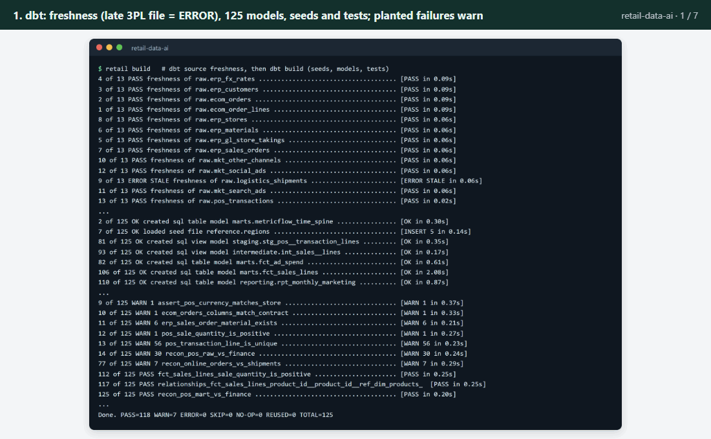

*A short recording of the project running from start to finish: the sales files are loaded and checked, a report
lists the problems found in them, the AI analyst answers questions, and a weekly advertising report is written.*

## What it does

A shop that sells in stores, online and to other businesses ends up with its sales spread across many separate
files. This project gathers them into one place every week, checks them for mistakes before anyone relies on them,
and lets staff ask questions such as "which advert brought in the most sales last month?" in plain English. The
answers always come from the same agreed definitions, so two people asking the same question get the same number.

## A real-life example

Hana is the marketing manager at Acme Kitchen Co., which sells kitchenware through seven shops in New Zealand and
Australia, two online stores and sixteen trade customers.

**Before:** her figures come from a dozen exports: the accounts system, the shop tills, the online store, the
delivery company and three advertising sites. Each week someone copies them into a spreadsheet by hand. Mistakes
slip through unnoticed: one shop's day of sales sent twice, Australian dollars labelled as New Zealand dollars, a
delivery file that never arrived. When she has a quick question she waits for an analyst, and two reports can
disagree on what "revenue" means.

**With this project:**
1. The files are loaded and checked automatically. A health report lists every problem it found, which file it is
   in, and what was done about it.
2. She types a question in plain English, for example "Which marketing channel gave the best return on ad spend
   in December?", and gets the answer with the figures it came from.
3. Every week a short written report on the advertising arrives. It is only released if every number in it
   matches the data.

**After:** in testing, the checks caught all 6 of the problems hidden in a year of data, with no false alarms. On 40
business questions the analyst got all 40 right, in about 3 seconds each. An AI that wrote its own database
queries without the agreed definitions got only 24 of the 40 right.

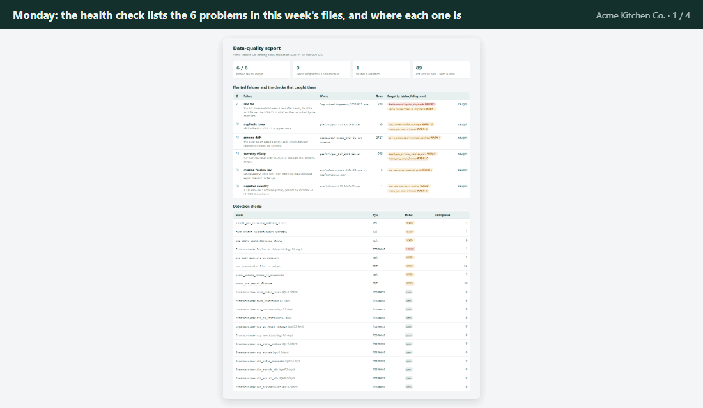

*Hana's week in four steps, from real screens of the project: the health report on this week's files, plain-English
questions and answers, the weekly advertising report, and the test on 40 business questions.*

## How you would use it

1. Your data team sets the project up once and points it at the folder where the weekly exports land.
2. Each week, open the data health report in your web browser. It shows which files arrived, what was wrong with
   them and whether the figures can be trusted.
3. Type a business question in plain English into the analyst. You get a short answer plus the table of figures
   behind it.
4. Read the weekly advertising report: spend, sales and return per channel, with a suggested action.
5. If a number looks odd, ask the analyst to explain how that figure is defined and where it comes from.

The commands for all of this are in [Setup](#setup) and [Usage](#usage) further down.

## Overview

**A retail data platform with an AI analyst on top.** Data from an ERP (the accounts and stock system), store tills, a web shop, a
logistics provider and three ad platforms is loaded into DuckDB (a fast, single-file database), shaped into clean
tables with dbt (a tool that builds tables from tested SQL queries), checked for data quality, reconciled against
finance, and exposed through a MetricFlow semantic layer (one shared list of how each business figure is
calculated). A TypeScript MCP server (MCP is a standard way for AI tools to call other software) lets AI tools
query those agreed figures, and an analyst agent and a weekly campaign-report agent answer through it.

The business is fictional: **Acme Kitchen Co.**, a maker of kitchen and home products with seven stores in New
Zealand and Australia, two web shops and sixteen wholesale customers. One financial year of data (April 2025 to
March 2026, about 220 files and 17 MB) is generated from a fixed seed, with six realistic data failures planted in
it and recorded as ground truth.

**Who it is for:** data and analytics engineers who want an end-to-end reference for retail pipelines with data
quality and a semantic layer, and teams connecting AI assistants to governed business data over MCP.

## Key features

- **Multi-source pipelines** (automated steps that load and clean each feed). ERP exports (`yyyymmdd` dates),
  POS (till) files per store, web-shop orders, weekly 3PL (outsourced delivery company) shipment files and three
  marketing exports with different formats, ingested into DuckDB.
- **dbt project (dbt-duckdb):** staging, intermediate and marts layers, 32 documented models, CTEs, window
  functions (calculations across neighbouring rows: `row_number` de-duplication, `lag`, running totals, `rank`/`dense_rank`) and multi-source joins.
- **Data quality that catches every planted failure:** `unique`, `not_null`, `relationships`, `accepted_values`,
  source freshness, a schema-contract test, and reconciliations of POS takings against the finance ledger and of
  web orders against shipments. A generated report shows which check caught which failure, and a webhook alert
  goes out (a local mock receiver is included).
- **Legacy migration with a parity test.** The original pandas script is kept as the "before" picture; on clean
  files its four reports equal the dbt marts to the cent, and on bad files the differences point at the failures.
- **Semantic layer in MetricFlow format:** revenue, gross margin, average order value, return on ad spend and
  on-time delivery rate, by date, channel, region and product category. MetricFlow validates it against DuckDB.
- **MCP server in TypeScript** (official SDK) with `list_metrics`, `query_metric`, `explain_metric` and
  `run_readonly_sql`; read-only DuckDB, allow-listed `SELECT` only; results identical to MetricFlow's.
- **Agents:** an analyst that answers questions through the MCP tools, and a weekly campaign-report writer whose
  report is rejected unless every number in it traces back to a query result.
- **Evaluation on accuracy, cost and latency:** 40 business questions with independent reference answers,
  comparing plain text-to-SQL (the AI writes its own database query) with the semantic-layer agent, including a 10-question holdout.

## Screenshots

| | |
|---|---|
| 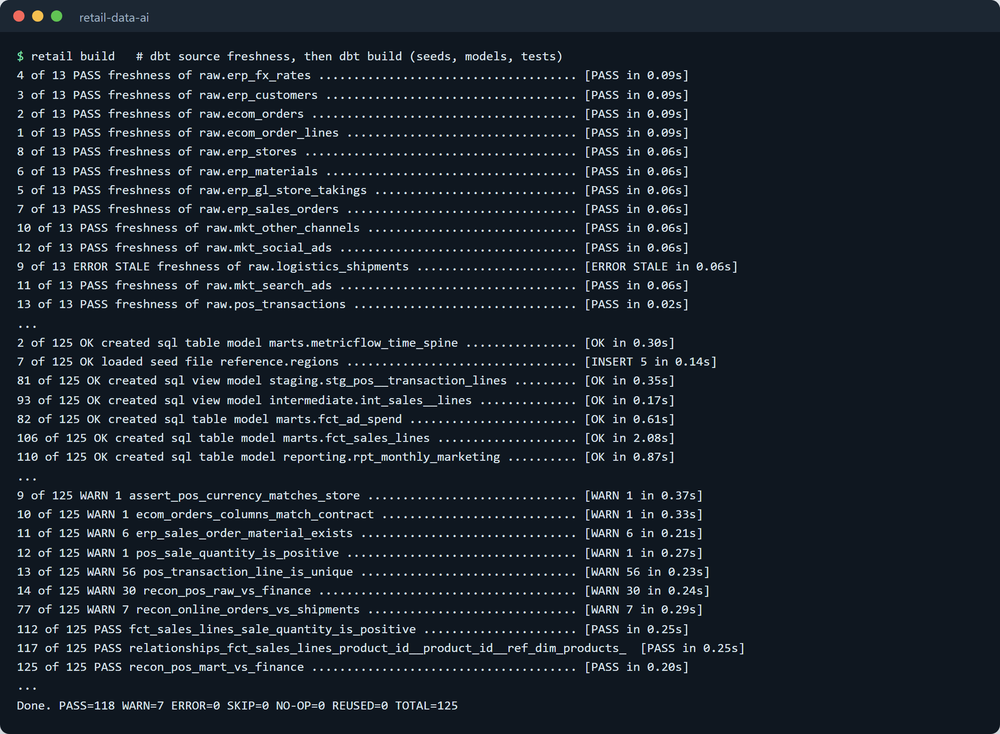 **Loading and checking the data.** The late delivery file is flagged as an error, the other planted problems as warnings, and the final tables and the check against the accounts pass. | 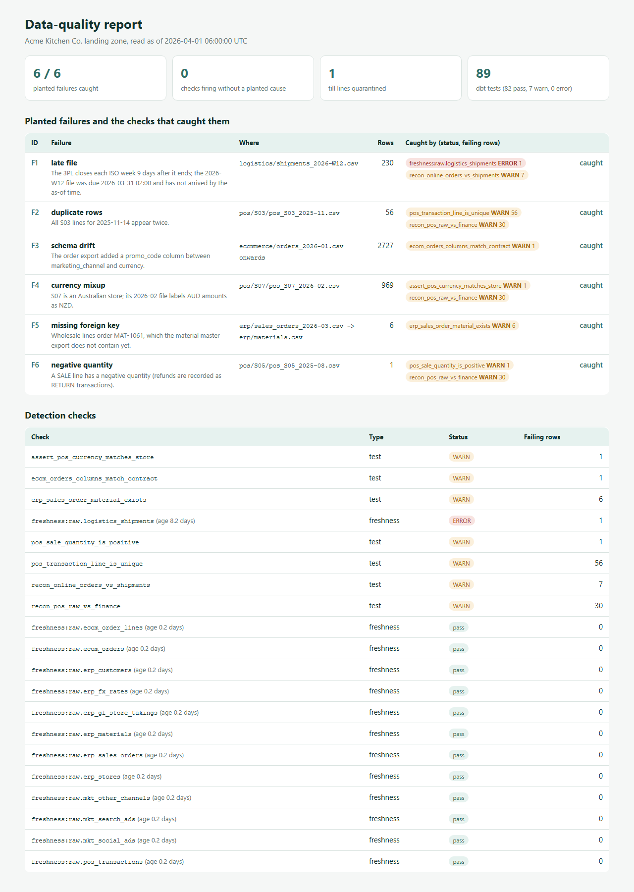 **Data health report.** Each problem hidden in the data, the check that caught it and how many rows it affected. |
| 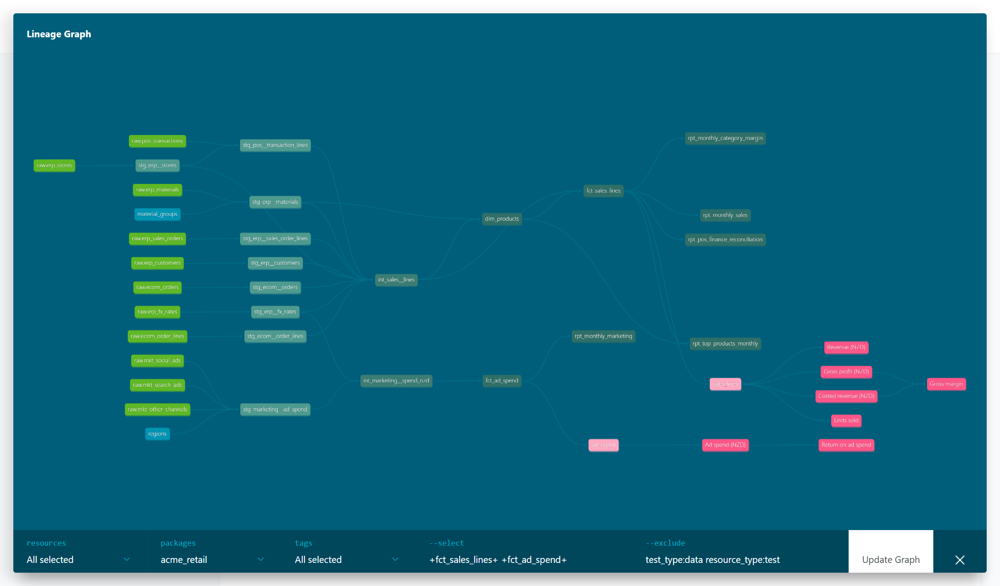 **Where each figure comes from.** The raw files flow through the cleaning steps to the final tables and figures. | 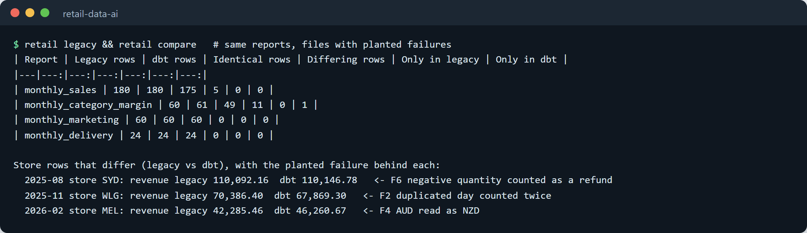 **Old reports vs new.** The old script takes the bad files at face value; every row where the two disagree traces back to one of the hidden problems. |
| 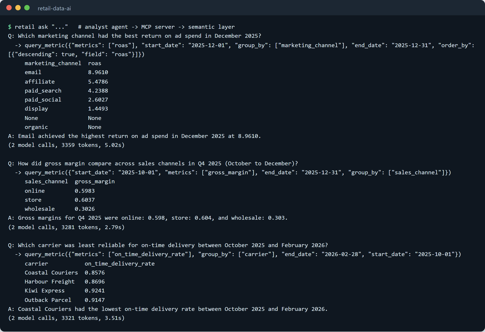 **Analyst agent.** Questions in plain English, the figures it looked up, and the answer. The AI picks a figure from the agreed list rather than writing its own query. | 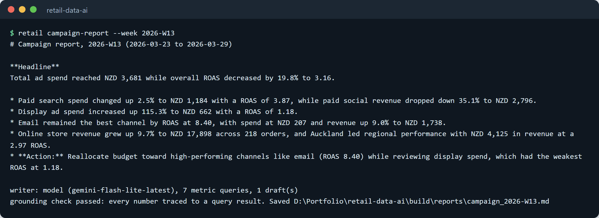 **Weekly advertising report**, written by the AI and released only after every number in it was matched to the data. |
| 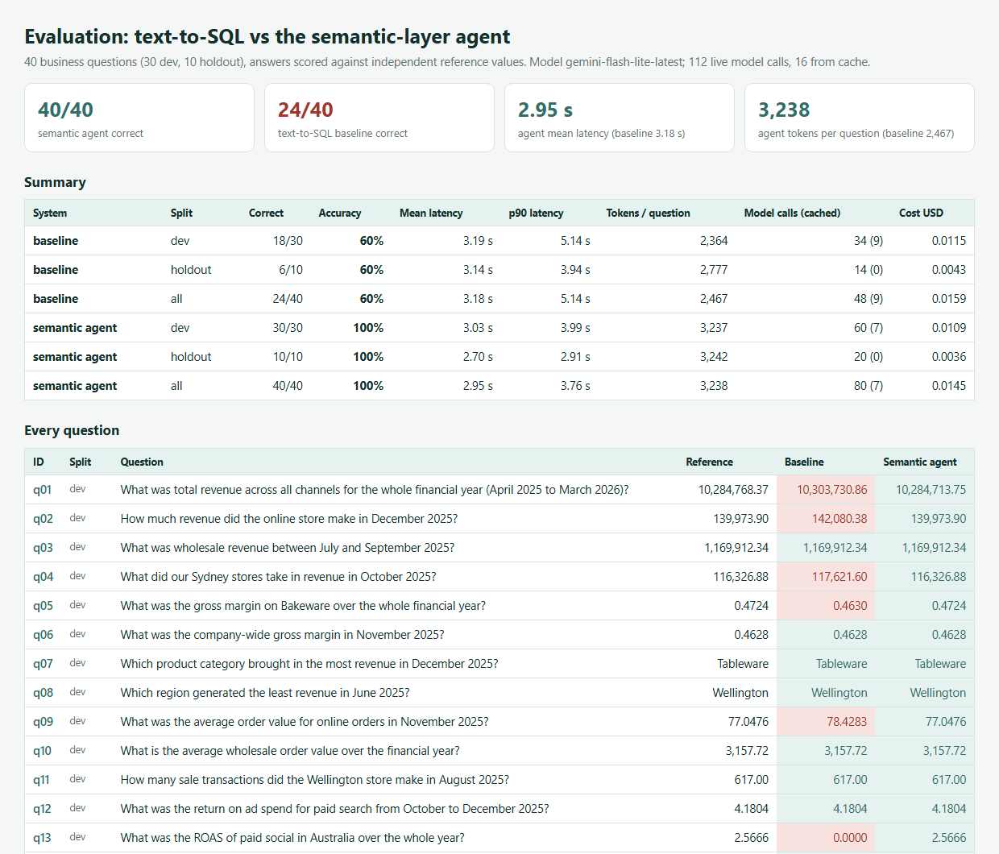 **Test results.** 40 business questions, both approaches, every answer compared with the correct figure. | 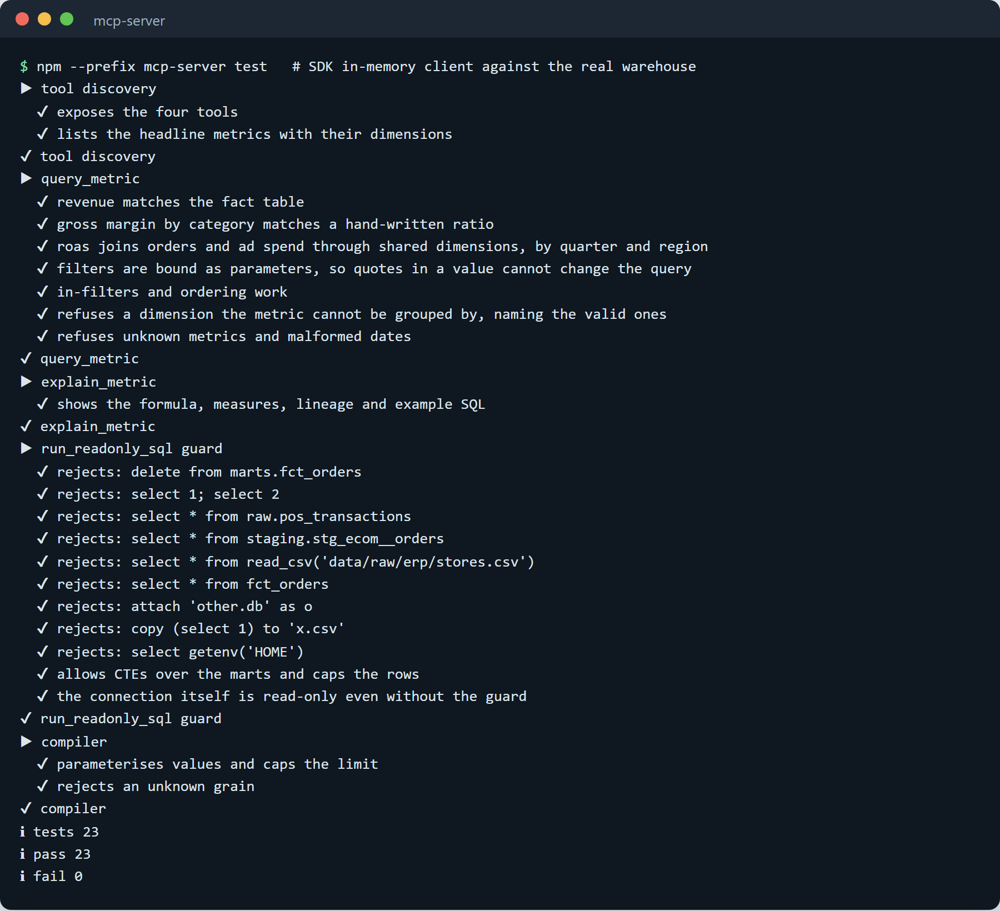 **Automated tests** for the part that lets AI tools read the figures, including the guard that allows read-only queries only. |

## Architecture

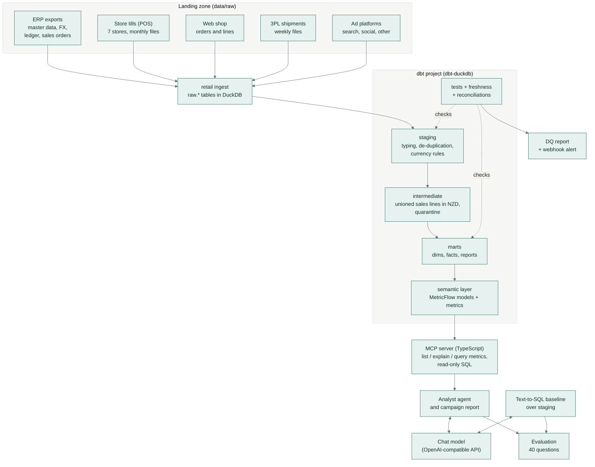

## How it works

1. **Generate.** `retail generate` simulates the year with seasonality (winter cooking, Black Friday, Christmas),
   promotions, refunds, FX rates, marketing spend sized per channel, and carrier performance. It then plants six
   failures and writes them to `data/ground_truth.json`.
2. **Ingest.** `retail ingest` loads each feed into `raw.<feed>` as text, combining a feed's files by column name
   so a drifted file still loads, and logs every file in `raw._ingest_log`.
3. **Freshness.** `dbt source freshness` compares each feed's latest `_extracted_at` with the as-of time
   (2026-04-01 06:00 UTC, replayed so results are the same on any day). The missing 3PL week is an error.
4. **Build and test.** `dbt build` runs seeds, 32 models and 89 tests. Detection tests on the raw feeds warn on bad
   deliveries; staging repairs what can be repaired (duplicates, currency labels) and quarantines what cannot (a
   negative sale quantity); tests on the marts must pass, including the reconciliation of cleaned store revenue
   with the finance ledger for every store-day.
5. **Data-quality report and alert.** `retail dq` reads dbt's artifacts and the ground truth, maps every planted
   failure to the checks designed for it, confirms the stored failing rows point at the planted location, writes
   Markdown and HTML reports, and posts a summary to `DQ_WEBHOOK_URL`.
6. **Semantic layer.** Metrics are defined in dbt's semantic layer (MetricFlow format) and validated with
   `mf validate-configs`.
7. **MCP server.** The TypeScript server reads dbt's `semantic_manifest.json`, compiles metric requests to SQL with
   MetricFlow's semantics, and runs them on a read-only DuckDB connection.
8. **Agents.** The analyst receives the metric catalogue, calls `query_metric` through MCP and answers in JSON.
   The campaign-report agent queries a week's marketing numbers, has the model write the report, and publishes it
   only if every number in the text matches a query result.
9. **Evaluate.** 40 questions are answered by both systems and scored against references computed with pandas from
   the generator's clean data.

### Asking the analyst a question

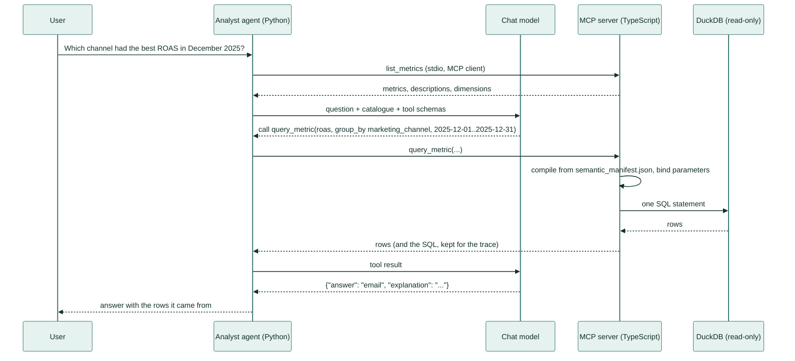

### Planted failures and the checks that catch them

| Failure | Planted as | Caught by | Handling |
|---|---|---|---|
| Late file | 3PL week 2026-W12 not delivered | source freshness (error), `recon_online_orders_vs_shipments` | alert; on-time figures wait for the file |
| Duplicate rows | one Wellington day sent twice (56 lines) | `pos_transaction_line_is_unique`, `recon_pos_raw_vs_finance` | first copy kept (`row_number()`) |
| Schema drift | `promo_code` added to web orders from Jan 2026 | `ecom_orders_columns_match_contract` | columns selected by name; values never shift |
| Currency mix-up | Melbourne's Feb 2026 till file labels AUD as NZD | `assert_pos_currency_matches_store`, `recon_pos_raw_vs_finance` | currency taken from the store master |
| Missing foreign key | 6 wholesale lines for a material not in the master | `erp_sales_order_material_exists` | revenue kept; inferred product (Unknown) |
| Negative quantity | a Sydney sale line keyed negative | `pos_sale_quantity_is_positive`, `recon_pos_raw_vs_finance` | line quarantined and reported |

Result on the generated data: **6 of 6 caught, 0 checks firing without a planted cause.** On a clean landing zone
every detection check passes. More detail: [docs/design.md](docs/design.md).

## Semantic layer and MCP tools

| Metric | Definition | Dimensions |
|---|---|---|
| `revenue` | net sales in NZD (refunds subtract; shipping and cancelled web orders excluded) | date, region, country, sales_channel, product_category |
| `gross_margin` | gross profit / revenue of lines with a known standard cost | date, region, country, sales_channel, product_category |
| `average_order_value` | revenue of sale orders / number of sale orders | date, region, country, sales_channel, marketing_channel |
| `roas` | attributed online revenue (paid channels, last touch) / ad spend | date, region, country, marketing_channel |
| `on_time_delivery_rate` | deliveries on or before the promised date / deliveries due | date, region, country, sales_channel, carrier |

Nine building-block metrics (`gross_profit`, `orders`, `ad_spend`, `attributed_revenue`, ...) are queryable too.

| MCP tool | What it does |
|---|---|
| `list_metrics` | the metric catalogue with descriptions and the dimensions each metric supports |
| `explain_metric` | formula, measures, source model, upstream lineage from dbt's manifest, and example SQL |
| `query_metric` | metrics by date (day, week, month, quarter, year) and dimensions, with a date range and filters |
| `run_readonly_sql` | one `SELECT` over the `marts` and `reporting` schemas, at most 200 rows |

The server compiles requests itself rather than calling MetricFlow, because MetricFlow's command line takes about
6 seconds per query and the compiled SQL runs in tens of milliseconds. `tests/test_semantic_parity.py` runs every
headline metric by every dimension through both and requires identical results. The SQL guard parses each
statement with DuckDB, allows only schema-qualified tables in the allow-listed schemas, and refuses table functions
such as `read_csv`; the connection is also opened read-only with external access disabled.

To use it from any MCP client, point the client at `node mcp-server/dist/src/index.js` (stdio), with
`RETAIL_WAREHOUSE` and `RETAIL_DBT_TARGET` set if the files are not in their default places.

## Evaluation results

40 business questions (30 development, 10 holdout written before any prompt was run and not used for tuning), each
answered by both systems with `gemini-flash-lite-latest`. References are computed with pandas from the generator's
clean data, independently of dbt; `retail eval --oracle` first checks that all 40 are answerable exactly through the
semantic layer (40/40).

| System | Split | Correct | Mean latency | p90 latency | Tokens per question | Est. cost |
|---|---|---:|---:|---:|---:|---:|
| Text-to-SQL baseline | dev | 18/30 (60%) | 3.19 s | 5.14 s | 2,364 | USD 0.0115 |
| Text-to-SQL baseline | holdout | 6/10 (60%) | 3.14 s | 3.94 s | 2,777 | USD 0.0043 |
| Semantic-layer agent | dev | 30/30 (100%) | 3.03 s | 3.99 s | 3,237 | USD 0.0109 |
| Semantic-layer agent | holdout | 10/10 (100%) | 2.70 s | 2.91 s | 3,242 | USD 0.0036 |
| **Baseline, all 40** | | **24/40 (60%)** | 3.18 s | 5.14 s | 2,467 | USD 0.0159 |
| **Semantic agent, all 40** | | **40/40 (100%)** | 2.95 s | 3.76 s | 3,238 | USD 0.0145 |

- **How it is measured.** A number is correct within 0.1% of the reference (a fraction may also be given as a
  percentage within 0.1 points); a label must match after normalising case and punctuation. Latency is the model
  time of the live calls plus tool or SQL time, excluding the pause kept between calls for the shared rate limit.
  Cost is estimated from the token counts at USD 0.10 / 0.40 per million input / output tokens (set in
  `retail_ai/llm.py`).
- **Model calls.** The recorded runs made 112 live calls; 16 more were answered from the cache of identical
  earlier calls. Every response is stored in `eval/cache/`, so `retail eval --offline` reproduces these results
  without a key. Full per-question results: [eval/results/summary.md](eval/results/summary.md).
- **Where the baseline goes wrong (16 questions):** it compares the order status with the wrong case and so counts
  cancelled orders, uses order subtotals before discounts, filters on values that do not exist (`'paid social'`,
  `'New Zealand'`, region `'AU'`) and returns zero or nothing, skips the AUD conversion for an Australian store, and
  picks the wrong label for close comparisons. The semantic agent avoids these because the definitions, the joins,
  the currency conversion and the valid dimension values live in the semantic layer.
- **Cost and latency:** the agent uses about 30% more tokens per question (the catalogue plus a tool round trip),
  mostly input tokens, while the baseline spends more on output (long SQL), so the estimated cost for all 40
  questions is similar (USD 0.0145 vs 0.0159). Mean latency is also similar (2.95 s vs 3.18 s): the agent makes
  two short calls per question, the baseline one longer call and, for 8 questions, a retry.

## Tech stack

| Area | Tools |
|---|---|
| Warehouse | DuckDB 1.5 |
| Transformation and tests | dbt-core 1.12, dbt-duckdb 1.11 |
| Semantic layer | dbt semantic layer / MetricFlow 0.213 |
| MCP server | TypeScript 5.9, `@modelcontextprotocol/sdk`, `@duckdb/node-api`, zod, Node's test runner |
| Data generation, ingestion, DQ report, agents, evaluation | Python 3.11, pandas, numpy, `mcp` (Python client), `openai` (any OpenAI-compatible endpoint) |
| Model used in the evaluation | `gemini-flash-lite-latest` through Gemini's OpenAI-compatible endpoint |
| Quality | ruff, tsc, pytest, GitHub Actions |

The same dbt project targets Databricks via dbt-databricks: `dbt/profiles.yml` includes a `databricks` profile,
and the few dialect differences (date parsing, date series) sit behind `adapter.dispatch` macros in
`dbt/macros/dialect/`. Everything in this repository runs and is tested on DuckDB.

## Setup

Requirements: Python 3.11, Node.js 20 or newer, about 1 GB of disk for the Python environment and 90 MB for the
MCP server's packages.

```bash
python -m venv .venv && source .venv/bin/activate      # Windows: .venv\Scripts\activate
bash scripts/setup.sh                                  # pip install -e ".[dev]", npm ci, npm run build
```

### Configuration

All settings are environment variables; none are stored in the repository.

| Variable | Used for | Default |
|---|---|---|
| `AI_API_KEY` | the chat model (analyst, model-written report, live evaluation) | not set: agents fall back or explain how to run without it |
| `AI_BASE_URL` | OpenAI-compatible endpoint | Gemini's OpenAI-compatible endpoint |
| `AI_MODEL` | model name | `gemini-flash-lite-latest` |
| `AI_MIN_INTERVAL_S` | minimum seconds between live model calls | `2.5` |
| `AI_PRICE_INPUT_PER_M`, `AI_PRICE_OUTPUT_PER_M` | prices for the cost estimate | `0.10`, `0.40` |
| `DQ_WEBHOOK_URL` | where `retail dq` posts its alert | not set: no alert sent |
| `RETAIL_DATA_DIR`, `RETAIL_WAREHOUSE`, `RETAIL_BUILD_DIR`, `RETAIL_DBT_TARGET` | move the data, warehouse, outputs or dbt artifacts | `data/`, `data/warehouse.duckdb`, `build/`, `dbt/target/` |
| `DATABRICKS_HOST`, `DATABRICKS_HTTP_PATH`, `DATABRICKS_TOKEN`, `DATABRICKS_CATALOG` | the optional `databricks` dbt target (`DBT_TARGET=databricks`) | not set |

## Usage

```bash
bash scripts/demo.sh                     # everything below except the live evaluation, in one command
```

| Command | What it does |
|---|---|
| `retail pipeline` | generate, ingest, freshness and `dbt build`, DQ report, legacy reports, comparison |
| `retail pipeline --clean` | the same on a landing zone without planted failures (every check passes) |
| `retail dq --alert http://127.0.0.1:8765/hook` | rebuild the DQ report and post the alert (start `python -m retail_ai.dq.mock_webhook` first) |
| `cd dbt && mf query --metrics roas --group-by marketing_channel__channel_name` | query the semantic layer with MetricFlow |
| `node mcp-server/dist/src/cli.js query '{"metrics":["revenue"],"group_by":["region"]}'` | the MCP server's tools from the command line |
| `retail ask "What was online revenue in December 2025?"` | ask the analyst (needs `AI_API_KEY`) |
| `retail campaign-report --week 2026-W13` | weekly report; model-written with a key, template without; grounding-checked either way |
| `retail eval --oracle` | no-model check: all 40 questions through the semantic layer against the references |
| `retail eval --split dev` / `--split holdout` | live evaluation of both systems (needs `AI_API_KEY`) |
| `retail eval --offline` | re-score the recorded run from `eval/cache/` |
| `retail eval --report` | rebuild `eval/results/summary.md` and `summary.html` from the recorded runs |

Outputs: `build/dq/dq_report.html` (and `.md`, `.json`), `build/legacy/*.csv`, `build/reports/campaign_<week>.md`,
`eval/results/`.

## Project structure

```
retail-data-ai/
├── retail_ai/                  Python package and `retail` CLI
│   ├── generator/              seeded simulation, planted failures, landing-zone writer
│   ├── ingest.py               landing zone -> raw.* tables in DuckDB
│   ├── pipeline.py             runs dbt (freshness, build, docs)
│   ├── dq/                     DQ report, expectations (failure -> checks), webhook alert, mock receiver
│   ├── legacy/legacy_reports.py  the legacy pandas script (kept as the migration reference)
│   ├── compare.py              legacy reports vs dbt reporting marts
│   ├── llm.py                  OpenAI-compatible client: disk cache, retries, call spacing
│   ├── mcp_client.py           Python MCP client for the TypeScript server
│   ├── agent/                  analyst, text-to-SQL baseline, campaign report, grounding check
│   └── eval/                   questions, pandas references, scoring, runner, HTML view
├── dbt/                        dbt project: sources, staging, intermediate, marts, semantic layer, tests, macros
├── mcp-server/                 TypeScript MCP server: compiler, SQL guard, lineage, tools, tests
├── eval/                       recorded evaluation results and the model-response cache
├── tests/                      pytest: generator, ingestion, pipeline, DQ, agents, MetricFlow parity
├── docs/                       design reference, screenshots, demo GIF
├── scripts/                    setup.sh, demo.sh
└── .github/workflows/ci.yml
```

## Tests

| Suite | Count | What it covers |
|---|---:|---|
| dbt data tests | 89 | 82 pass and 7 warn (the planted failures) on the generated data; 89 pass on clean data |
| Python (pytest) | 28 | generator invariants and reproducibility, ingestion with drift, legacy comparison, DQ report and alert, clean-data run with legacy parity, agent tool loop and grounding, MetricFlow parity for 7 dimension groups |
| TypeScript (node:test) | 23 | MCP tools through the SDK's in-memory client, metric correctness, parameter binding, the SQL guard, read-only connection, compiler |
| Evaluation, no-model path | 40 | every question through the semantic layer matches its independent reference |

CI (`.github/workflows/ci.yml`) runs, with no model calls: ruff and tsc, `retail pipeline` (generate, ingest,
freshness, `dbt build`, DQ report), `mf validate-configs`, the TypeScript tests, pytest, `retail eval --oracle` and
the template campaign report. The same commands pass locally.

## Licence

MIT. See [LICENSE](LICENSE).
